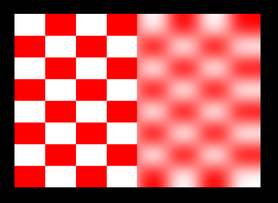
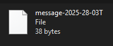
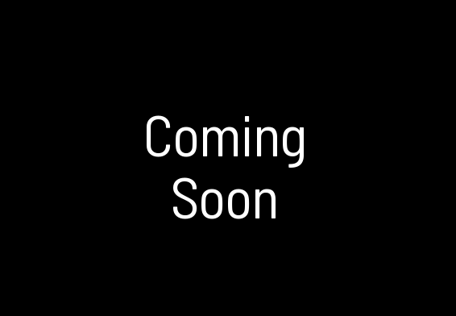

# Attract Mode Modules

> Attract-Mode Modules, Plugins, and Scripts  
> Chadnaut 2025  
> https://github.com/Chadnaut/Attract-Mode-Modules  
>\
>[][extension]
Get the [*AM+ Squirrel*][extension] extension for VS Code
 A suite of support tools to enhance your AM+ development experience. Code completions, highlighting, linting, formatting, and more!

[extension]: https://marketplace.visualstudio.com/items?itemName=chadnaut.am-squirrel

## Quickstart

- Download the repository using the green button `Code` > `Download ZIP`.
- Extract the desired `module` / `plugin` / `layout` into the corresponding AM folder.
- Configure your AM display to use the provided example layout.

## Modules

- *Debug* - Testing or debugging during development.
- *Element* - A new layout element with unique behaviors.
- *Shader* - Adds an effect to an existing layout element.
- *Utility* - Additional functions and classes.

[Blur]: ./modules/blur/README.md
[Chart]: ./modules/chart/README.md
[Console]: ./modules/console/README.md
[Ease]: ./modules/ease/README.md
[FileSystem]: ./modules/fs/README.md
[Frame]: ./modules/frame/README.md
[LogPlus]: ./modules/logplus/README.md
[Mask]: ./modules/mask/README.md
[MessageQueue]: ./plugins/MessageQueue/README.md
[Perspective]: ./modules/perspective/README.md
[Quicksort]: ./modules/quicksort/README.md
[Regex]: ./modules/regex/README.md
[Retention]: ./modules/retention/README.md
[Sequence]: ./modules/sequence/README.md
[Stringify]: ./modules/stringify/README.md
[Timer]: ./modules/timer/README.md
[UnitTest]: ./modules/unittest/README.md

|Preview|Version|Description|Type|Demo|
|-|-|-|-|-|
|[][Blur]|`v0.1.0`|[Blur] - Gaussian blur|*Shader*|[Example](./layouts/Example.Blur/)|
|[][Chart]|`v1.2.0`|[Chart] - Plot events over time|*Element*|[Example](./layouts/Example.Chart/)|
|[][Console]|`v0.9.1`|[Console] - Coloured message list with animated typing|*Element*|[Example](./layouts/Example.Console/)|
|[][Ease]|`v0.9.0`|[Ease] - Easing methods|*Utility*|[Example](./layouts/Example.Ease/)|
|[][Frame]|`v0.1.1`|[Frame] - 9-slice image scaling|*Shader*|[Example](./layouts/Example.Frame/)|
|[][FileSystem]|`v0.9.0`|[FileSystem] - File reading and writing|*Utility*|[Example](./layouts/Example.FileSystem/)|
|[][LogPlus]|`v0.6.4`|[LogPlus] - Extended logging functionality|*Debug*|[Example](./layouts/Example.LogPlus/)|
|[][Mask]|`v0.3.1`|[Mask] - 9-slice image masking|*Shader*|[Example](./layouts/Example.Mask/)|
|[][UnitTest]|`v0.1.1`|[MessageQueue] - Send messages using files|*Utility*|[Example](./plugins/MessageQueue/README.md#quickstart)|
|[][Perspective]|`v0.5.4`|[Perspective] - Perspective correct texture mapping|*Shader*|[Example](./layouts/Example.Perspective/)|
|[][Quicksort]|`v0.1.1`|[Quicksort] - Yielding Quicksort|*Utility*|[Example](./layouts/Example.Quicksort/)|
|[][Regex]|`v0.2.1`|[Regex] - Regular Expression handler|*Utility*|[Example](./layouts/Example.Regex/)|
|[][Retention]|`v0.7.2`|[Retention] - Surface image persistence|*Shader*|[Example](./layouts/Example.Retention/)|
|[][UnitTest]|`T.B.A.`|[Sequence] - Stackable animation system|*Utility*||
|[][Stringify]|`v0.1.8`|[Stringify] - JSON-like value stringification|*Utility*|[Example](./layouts/Example.Stringify/)|
|[][Timer]|`v0.3.0`|[Timer] - Call a function at a later time|*Utility*|[Example](./layouts/Example.Timer/)|
|[][UnitTest]|`v1.1.2`|[UnitTest] - Testing and benchmarking|*Debug*|[Test](./layouts/Example.UnitTest/) [Bench](./layouts/Example.Benchmark/)|

*NOTE: Shader-based effects such as Blur, Frame, and Mask will not work simultaneously upon a single element. This can be achieved by nesting elements within Surfaces and applying one effect to each element.*

## Looking for More?

For experiments that haven't made it to the Module stage check out:

- https://github.com/Chadnaut/Attract-Mode-Experiments
