# Attract Mode Modules

> Attract-Mode Modules, Plugins, and Scripts  
> Chadnaut 2024  
> https://github.com/Chadnaut/Attract-Mode-Modules

## For Designers

Extra features designers can use to build layouts.

### Modules

|Screenshot|Version|Module|Example|
|:-|:-|:-|:-|
|[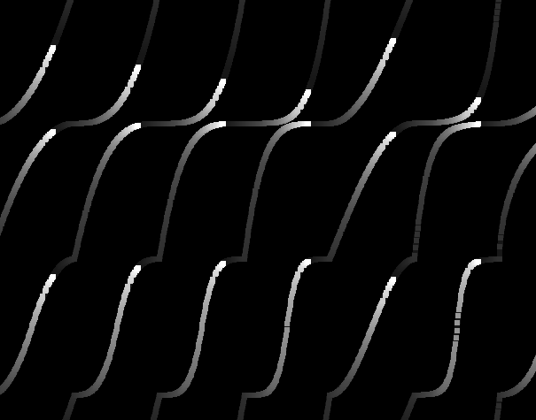](./modules/ease/README.md)|v0.9.0|[Ease](./modules/ease/README.md) - Easing methods|[Example](./layouts/Example.Ease/)|
|[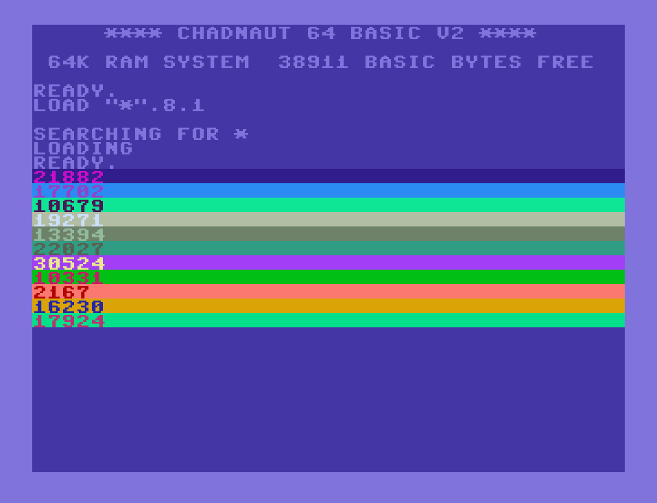](./modules/console/README.md)|v0.9.0|[Console](./modules/console/README.md) - Coloured message list with animated typing|[Example](./layouts/Example.Console/)|
|[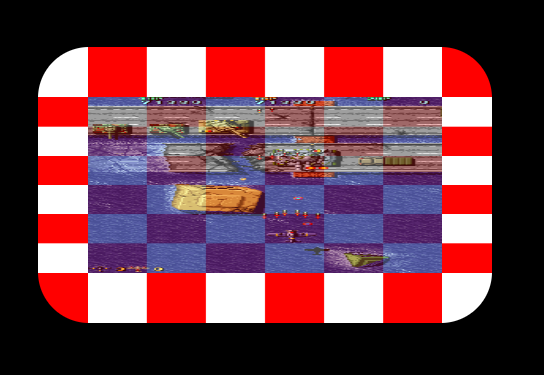](./modules/frame/README.md)|v0.1.1|[Frame](./modules/frame/README.md) - 9-slice image scaling|[Example](./layouts/Example.Frame/)|
|[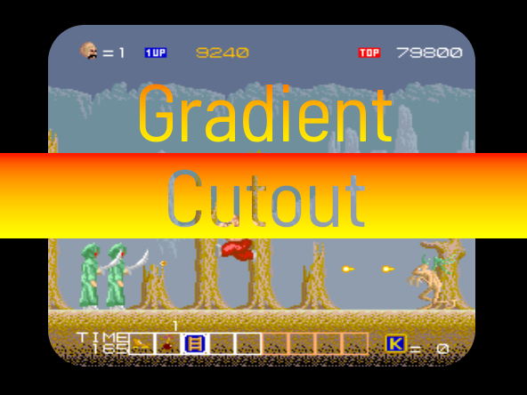](./modules/mask/README.md)|v0.3.1|[Mask](./modules/mask/README.md) - 9-slice image masking|[Example](./layouts/Example.Mask/)|
|[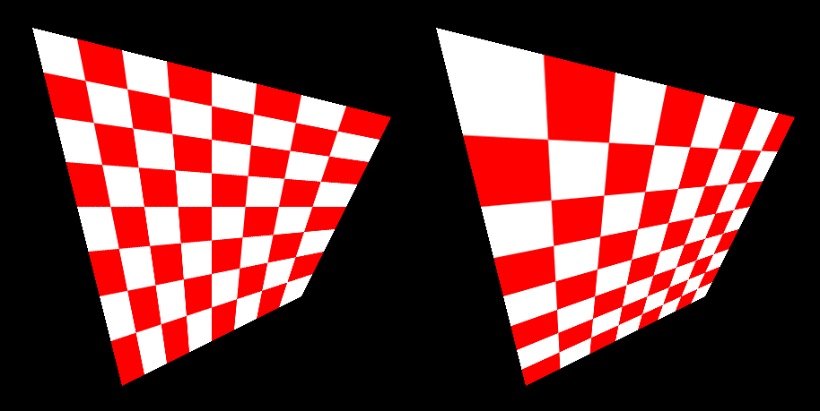](./modules/perspective/README.md)|v0.5.4|[Perspective](./modules/perspective/README.md) - Perspective correct texture mapping|[Example](./layouts/Example.Perspective/)|
|[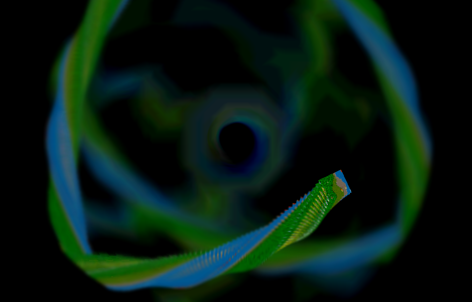](./modules/retention/README.md)|v0.7.2|[Retention](./modules/retention/README.md) - Surface image persistence|[Example](./layouts/Example.Retention/)|
|Coming Soon|-|[Sequence](./modules/sequence/README.md) - Stackable animation system|Coming Soon|

## For Developers

Tools and utilities to improve workflow and debugging.

### Modules

|Screenshot|Version|Module|Example|
|:-|:-|:-|:-|
|[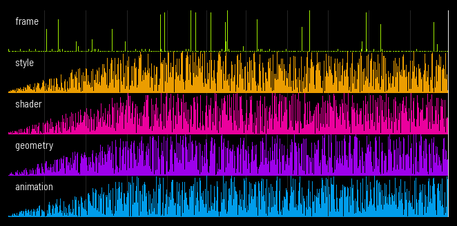](./modules/chart/README.md)|v1.2.0|[Chart](./modules/chart/README.md) - Plot events over time|[Example](./layouts/Example.Chart/)|
|[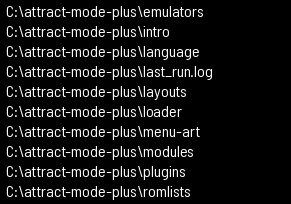](./modules/fs/README.md)|v0.8.1|[FileSystem](./modules/fs/README.md) - File reading and writing|[Example](./layouts/Example.FileSystem/)|
|[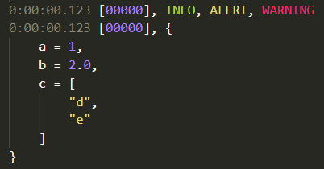](./modules/logplus/README.md)|v0.6.2|[LogPlus](./modules/logplus/README.md) - Extended logging functionality|[Example](./layouts/Example.LogPlus/)|
|[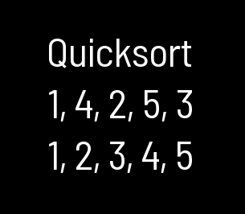](./modules/quicksort/README.md)|v0.1.1|[Quicksort](./modules/quicksort/README.md) - Yielding Quicksort|[Example](./layouts/Example.Quicksort/)|
||v0.1.1|[Regex](./modules/regex/README.md) - Regular Expression handler|[Example](./layouts/Example.Regex/)|
|[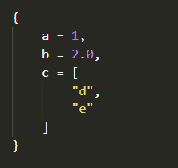](./modules/stringify/README.md)|v0.1.5|[Stringify](./modules/stringify/README.md) - JSON-like value stringification|[Example](./layouts/Example.Stringify/)|
|[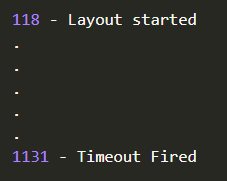](./modules/timer/README.md)|v0.2.0|[Timer](./modules/timer/README.md) - Call a function at a later time|[Example](./layouts/Example.Timer/)|
||v1.1.2|[UnitTest](./modules/unittest/README.md) - Testing and benchmarking|[Testing](./layouts/Example.UnitTest/) [Benchmarking](./layouts/Example.Benchmark/)|

### Plugins

|Type|Version|Module|Example|
|:-|:-|:-|:-|
|Plugin|v0.1.0|[Reload hotkey](./plugins/ReloadHotkey/README.md) - Reload layout when custom key pressed|[Example](./plugins/ReloadHotkey/README.md#quickstart)|

### Scripts

|Type|Version|Module|Example|
|:-|:-|:-|:-|
|Python|v0.2.0|[Keypress](./scripts/keypress/README.md) - Send keypress to a window|[Example](./scripts/keypress/README.md#example)|
|Python|v0.3.0|[Link](./scripts/link/README.md) - Create a series of symlinks|[Example](./scripts/link/README.md#example)|
|Python|v0.1.1|[Version](./scripts/version/README.md) - Sync version info between files|[Example](./scripts/version/README.md#example)|

## Looking for More?

Sometimes short demos are created to illustrate a concept - for experiments that haven't made it to the module stage checkout:

https://github.com/Chadnaut/Attract-Mode-Experiments
