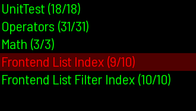

# Attract Mode Modules

> Attract-Mode Modules, Plugins, and Scripts  
> Chadnaut 2024  
> https://github.com/Chadnaut/Attract-Mode-Modules

## Contents

### Layouts

- Working examples of the modules below

### Modules

|Screenshot|Version|Module|
|-|-|-|
||v1.1|[Chart](./modules/chart/README.md) - Plot events over time|
||v0.7|[Console](./modules/console/README.md) - Coloured message list|
||v0.9|[Ease](./modules/ease/README.md) - Easing methods|
||v0.1|[Frame](./modules/frame/README.md) - 9-slice image scaling|
||v0.6|[LogPlus](./modules/logplus/README.md) - Extended logging functionality|
||v0.3|[Mask](./modules/mask/README.md) - 9-slice image masking |
||v0.5|[Perspective](./modules/perspective/README.md) - Perspective correct texture mapping|
||v0.6|[Retention](./modules/retention/README.md) - Surface image persistance |
||v0.1|[Stringify](./modules/stringify/README.md) - JSON-like value stringification|
||v0.2|[Timer](./modules/timer/README.md) - Call a function at a later time|
||v1.0|[UnitTest](./modules/unittest/README.md) - Testing and benchmarking|

### Plugins

- [ReloadHotkey](./plugins/ReloadHotkey/README.md) **v0.1** - Reload layout when custom key pressed

### Scripts

- [Keypress](./scripts/keypress/README.md) **v0.2** - Send keypress to a window
- [Link](./scripts/link/README.md) **v0.3** - Create a series of symlinks