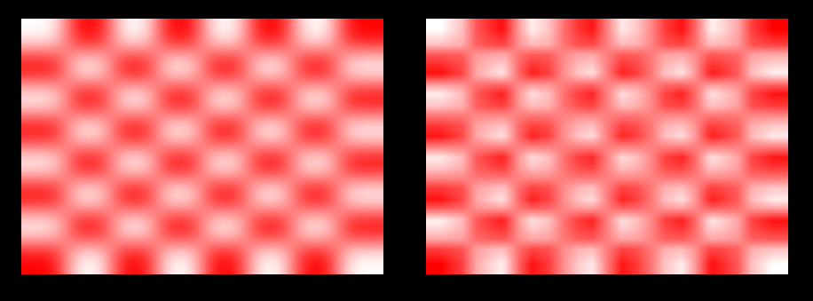
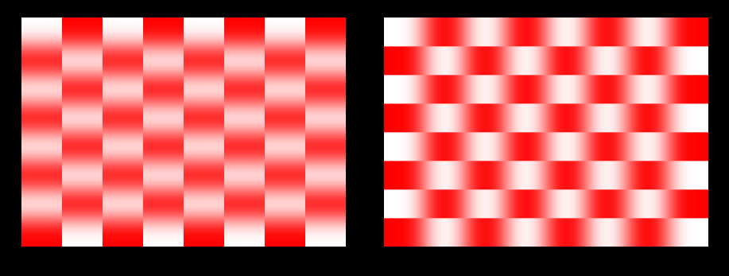
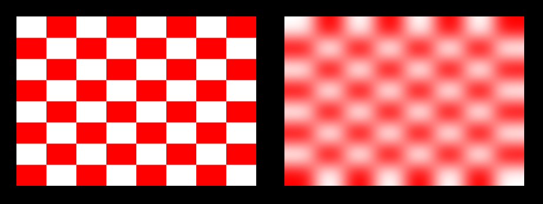
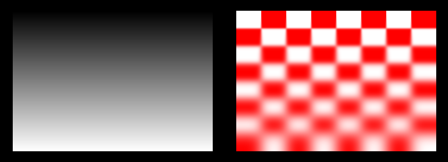
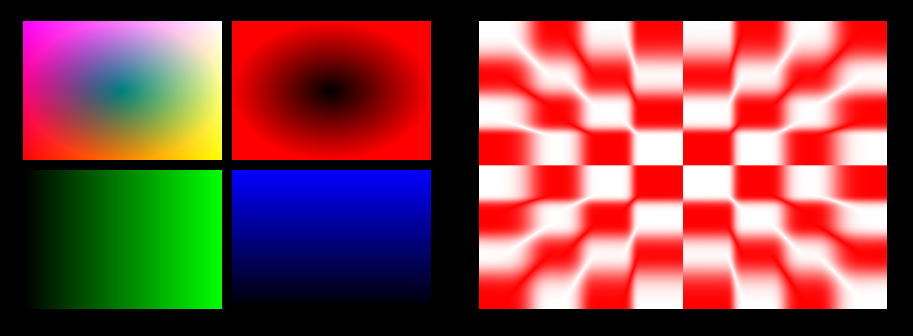

# Blur

> Gaussian blur  
> Version 0.1.0  
> Chadnaut 2024  
> https://github.com/Chadnaut/Attract-Mode-Modules

## Quickstart

```cpp
fe.load_module("blur");

local object = Blur(fe.add_artwork("snap", 0, 0, 400 400));
object.blur_size = 50;
```

Wrap your Image, Artwork or Surface with the `Blur()` class and use the resulting instance in its place.

## Properties

- `blur_size` *int* - (Optional, default = 0) Blur amount in pixels.
- `blur_rotation` *float* - (Optional, default = 0) Blur direction, 0...360 clockwise from north.
- `blur_fast` *bool* - (Optional, default = false) True to use mipmap blur.
- `blur_mask` *fe.Image* - (Optional) Image for masking.
- `blur_channel` *bool* - (Optional, default = false) True to use mask channels (see below).
- `is_surface` *bool* - (Optional, default = auto) True to fix y-axis flipping on surfaces.

## Usage

### Gaussian vs Fast Blur

Gaussian blur is *GPU intensive*, as each pixel is the result of sampling numerous neighbouring pixels. The performance cost grows exponentially as `blur_size` increases - large blurs on 4k images may grind AM to a halt!

Fast blur (`blur_fast = true`) however is effectively *free*, as it uses low-res texture mipmaps instead of multi-sampling. It does not support direction, and the end result is lower quality, but it can easily run at any size on any hardware.

\
*Gaussian (left), Fast (right)*

### Direction

Gaussian blur samples neighbouring pixels in a straight line, resulting in a directional blur. The line angle is set by `blur_rotation` where `0` is vertical and `90` is horizontal.

\
*Rotation 0 (left), Rotation 90 (right)*

### 2-Pass

A full gaussian blur requires sampling both vertically and horizontally. Using two-passes is *much* more efficient than processing a single-pass gaussian box blur.

```cpp
// A surface with an image inside it, both using Blur()
local surf = Blur(::fe.add_surface(400, 400));
local img = Blur(surf.add_artwork("snap", 0, 0, surf.width, surf.height));
// One blurs vertically
surf.blur_size = 50;
surf.blur_rotation = 0;
// The other blurs horizontally
img.blur_size = 50;
img.blur_rotation = 90;
```

\
*Original (left), 2-Pass (right)*

### Mask

Pass `blur_mask` a grayscale `fe.Image` instance to affect blur strength, multiplying `blur_size` where black is `0%` and white is `100%`.

\
*Mask (left), 2-Pass + Mask (right)*

#### Channels

If `blur_channel` is `true` the provided `blur_mask` colour channels will be used for:

- `red` - Blur strength.
- `green` - Point x `0...255` = `-1...1`
- `blue` - Point y `0...255` = `-1...1`

The `green` & `blue` values describe a point which provides an angle for the gaussian direction.

\
*Mask Channels (left), 2-Pass + Mask Channels (right)*

The Open Source [Gimp](https://www.gimp.org/downloads/) image editor can be used to edit individual colour [channels](https://docs.gimp.org/en/gimp-channel-dialog.html).

## Further Reading

- [TwoPass Gaussian Blur vs OnePass](https://www.shadertoy.com/view/ltBXRh)
- [The Normal Distribution](https://condor.depaul.edu/sjost/it223/documents/normal.htm)
- [Effect of variance (sigma) at Gaussian smoothing](https://stackoverflow.com/questions/23007064/effect-of-variance-sigma-at-gaussian-smoothing)
- [Bloom](https://learnopengl.com/Advanced-Lighting/Bloom)
