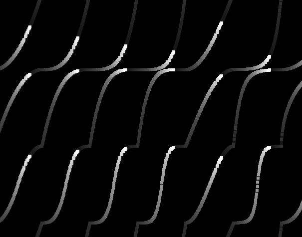

# Ease

> Easing methods  
> Version 0.8  
> Chadnaut 2024  
> https://github.com/Chadnaut/Attract-Mode-Modules

## Quickstart

```cpp
fe.load_module("ease");

for (local i=0, n=10; i<=n; i++) {
    print(::ease.outCubic(i.tofloat(), 0.0, 1.0, n.tofloat()) + "\n");
}
```

```log
0
0.271
0.488
0.657
0.784
0.875
0.936
0.973
0.992
0.999
1
```

\
*Example easings*

## Functions

### Penner

- `::ease.none(t, b, c, d)`
- `::ease.linear(t, b, c, d)`
- `::ease.inQuad(t, b, c, d)`
- `::ease.inCubic(t, b, c, d)`
- `::ease.inQuart(t, b, c, d)`
- `::ease.inQuint(t, b, c, d)`
- `::ease.inSine(t, b, c, d)`
- `::ease.inExpo(t, b, c, d)`
- `::ease.inCirc(t, b, c, d)`
- `::ease.inElastic(t, b, c, d)`
- `::ease.inBack(t, b, c, d)`
- `::ease.inBounce(t, b, c, d)`
- `::ease.outQuad(t, b, c, d)`
- `::ease.outCubic(t, b, c, d)`
- `::ease.outQuart(t, b, c, d)`
- `::ease.outQuint(t, b, c, d)`
- `::ease.outSine(t, b, c, d)`
- `::ease.outExpo(t, b, c, d)`
- `::ease.outCirc(t, b, c, d)`
- `::ease.outElastic(t, b, c, d, a?, p?)`
- `::ease.outBack(t, b, c, d, s?)`
- `::ease.outBounce(t, b, c, d)`
- `::ease.inOutQuad(t, b, c, d)`
- `::ease.inOutCubic(t, b, c, d)`
- `::ease.inOutQuart(t, b, c, d)`
- `::ease.inOutQuint(t, b, c, d)`
- `::ease.inOutSine(t, b, c, d)`
- `::ease.inOutExpo(t, b, c, d)`
- `::ease.inOutCirc(t, b, c, d)`
- `::ease.inOutElastic(t, b, c, d, a?, p?)`
- `::ease.inOutBack(t, b, c, d, s?)`
- `::ease.inOutBounce(t, b, c, d)`
- `::ease.outInQuad(t, b, c, d)`
- `::ease.outInCubic(t, b, c, d)`
- `::ease.outInQuart(t, b, c, d)`
- `::ease.outInQuint(t, b, c, d)`
- `::ease.outInSine(t, b, c, d)`
- `::ease.outInExpo(t, b, c, d)`
- `::ease.outInCirc(t, b, c, d)`
- `::ease.outInElastic(t, b, c, d, a?, p?)`
- `::ease.outInBack(t, b, c, d, s?)`
- `::ease.outInBounce(t, b, c, d)`

### Step

- `::ease.stepJumpStart(t, b, c, d, n)`
- `::ease.stepJumpEnd(t, b, c, d, n)`
- `::ease.stepJumpNone(t, b, c, d, n)`
- `::ease.stepJumpBoth(t, b, c, d, n)`

### Cubic Bezier

- `::ease.cubicBezier(x1, y1, x2, y2)` - Returns an easing function `function(t, d, c, d) {}`
  - Visit [cubic-bezier](https://cubic-bezier.com/) for an interactive bezier creation tool.

## Arguments

All easings accept the following arguments:

- `t` *float* - Current time (0...duration)
- `b` *float* - Beginning value (from)
- `c` *float* - Change in value (to - from)
- `d` *float* - Duration

Some easings accept optional arguments:

- `a` *float* = Amplitude
- `p` *float* = Period
- `s` *float* = Overshoot
- `n` *int* = Number of steps

## Further Reading

- [Robert Penner's Easing Functions](http://robertpenner.com/easing/)
- [Easing functions](https://easings.net/)
- [MDN animation-timing-function](https://developer.mozilla.org/en-US/docs/Web/CSS/animation-timing-function)
- [MDN easing-function](https://developer.mozilla.org/en-US/docs/Web/CSS/easing-function#cubic_b%C3%A9zier_easing_function)
- [Bézier curve](https://en.wikipedia.org/wiki/B%C3%A9zier_curve)
- [gre/bezier-easing](https://github.com/gre/bezier-easing/blob/master/src/index.js)