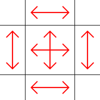

# Frame

> 9-slice image scaling  
> Version 0.1.1  
> Chadnaut 2024  
> https://github.com/Chadnaut/Attract-Mode-Modules

## Quickstart

```cpp
fe.load_module("frame");

local frame = Frame(fe.add_image("frame.png", 50, 50, 400, 300));
frame.set_slice(50, 50, 50, 50);
```

\
*A 9-slice image with padding, plus a snap in the same position*

## Properties

- `slice_left` *int* - Width of left 9-slice column `c1`.
- `slice_right` *int* - Width of right 9-slice column `c3`.
- `slice_top` *int* - Height of top 9-slice row `r1`.
- `slice_bottom` *int* - Height of bottom 9-slice row `r3`.
- `padding_left` *int* - Width of left padding.
- `padding_right` *int* - Width of right padding.
- `padding_top` *int* - Height of top padding.
- `padding_bottom` *int* - Height of bottom padding.

The `padding_*` properties are used to offset the frame from its original position, which allows a frame to be given an identical position to another object while drawing "around" it.

## Functions

- `set_slice(l, t, r, b)` - Set all slice sizes at once.
- `set_padding(l, t, r, b)` - Set all padding sizes at once.

## 9-Slice



- The image is sliced into a 3x3 grid
- The corners do not change size when the object scales
- The middle row stretches vertically
- The center column stretches horizontally

## Notes

- Non-integer scaling with padding may result in the 9-slice center being a fraction of a pixel off the intended size.
- When using with a `surface` the properties `slice_top` and `slice_bottom` must be swapped due to how surfaces work internally.
- When using with a `surface` the you should set to `blend_mode` to `BlendMode.Alpha`.
- The effect breaks when `width < slice_left + slice_right - padding_left - padding_right + 2` or `height < slice_top + slice_bottom - padding_top - padding_bottom + 2`, ie: don't make the frame smaller than the slices.

## Further Reading

- [9-slice scaling](https://en.wikipedia.org/wiki/9-slice_scaling)