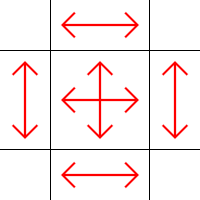
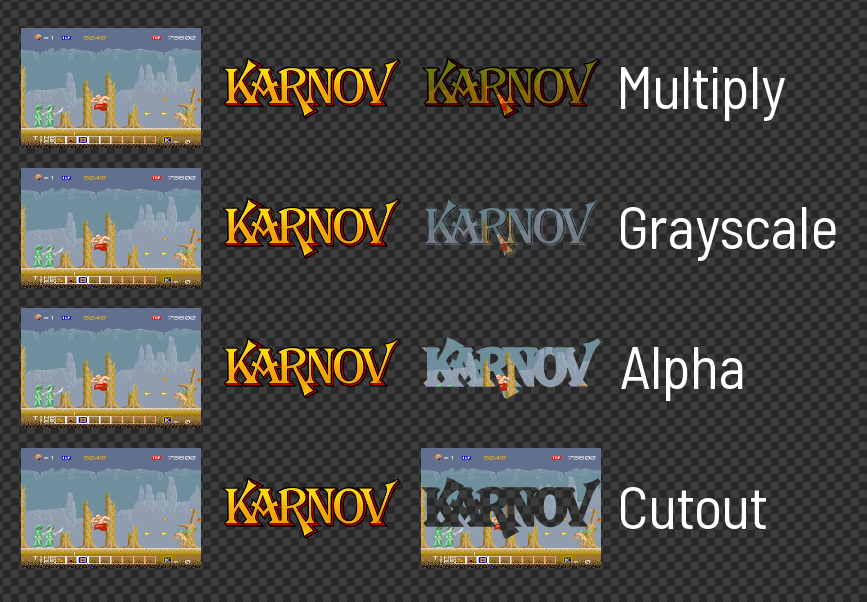
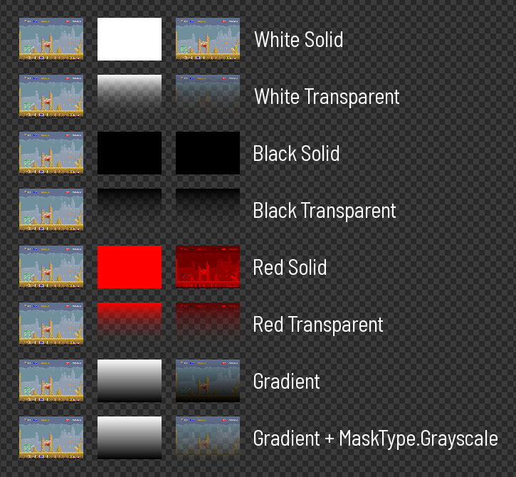

# Mask

> 9-slice image masking  
> Version 0.3.1  
> Chadnaut 2024  
> https://github.com/Chadnaut/Attract-Mode-Modules

## Quickstart

```cpp
::fe.load_module("mask");

local mask = ::fe.add_image("mask.png");
mask.visible = false;

local art = Mask(::fe.add_image("mask.png", 50, 50, 400, 300));
art.mask = mask;
art.set_mask_slice(50, 50, 50, 50);
```

\
*A 9-slice mask, text with a gradient mask, and a gradient with a text mask*

## Properties

- `mask` *::fe.Image* - Source texture for the mask.
- `mask_type` *enum* - Type of mask to use (see [Mask Types](#mask-types)).
- `mask_mirror_x` *bool* - Flip the mask horizontally.
- `mask_mirror_y` *bool* - Flip the mask vertically.
- `mask_slice_left` *int* - Width of mask left 9-slice column.
- `mask_slice_right` *int* - Width of mask right 9-slice column.
- `mask_slice_top` *int* - Height of mask top 9-slice row.
- `mask_slice_bottom` *int* - Height of mask bottom 9-slice row.

## Functions

- `set_mask_slice(l, t, r, b)` - Set all mask slice sizes at once.

## 9-Slice



- The image is sliced into a 3x3 grid
- The corners do not change size when the object scales
- The middle row stretches vertically
- The center column stretches horizontally

## Masks

You can use [GIMP](https://www.gimp.org/downloads/) to create masks. To create a mask like the one in the example:
- File > New... > 400x400 > Advanced > Fill with: Transparency > Ok
- Select > All
- Select > Rounded Rectangle... > Radius%: 20 > Ok
- Edit > Fill with BG Color (white)
- File > Export As... > mask.png > Export

For a fading edge you might do something like:
- File > New... > 400x400 > Advanced > Fill with: Transparency > Ok
- Select > All
- Select > Shrink... > 10px > Ok
- Select > Rounded Rectangle... > Radius%: 20 > Ok
- Select > Feather... > 10px > Ok
- Edit > Fill with BG Color (white)
- File > Export As... > mask.png > Export

Note: Pressing `d` will change your selected foregound/background colours back to the default black/white.

## Mask Types



- `MaskType.None` - Do nothing (no mask).
- `MaskType.Multiply` - (Default) Multiply using mask colour.
- `MaskType.Grayscale` - Use the lightness of the mask as alpha.
- `MaskType.Alpha` - Use the alpha of the mask.
- `MaskType.Cutout` - Use the inverted alpha of the mask.

\
*Source, Mask, Result. Unless noted the examples above use **MaskType.Multiply***

## Notes

- The properties `subimg_*` and `preserve_aspect_ratio` do not apply to mask textures, if using these place the object inside a surface, and use that as the mask.
- Non-integer scaling may result in the 9-slice mask being a fraction of a pixel off the intended size.
- When using with a `surface` the `mask_mirror_y = 1` must be set due to how surfaces work internally.
- The mask breaks when `width < mask_slice_left + mask_slice_right + 2` or `height < mask_slice_top + mask_slice_bottom + 2`, ie: don't make the object smaller than the slices.
