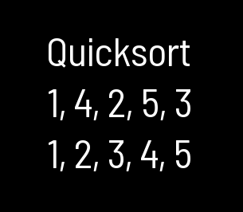

# Quicksort

> Yielding Quicksort  
> Version 0.1.0  
> Chadnaut 2024  
> https://github.com/Chadnaut/Attract-Mode-Modules

## Quickstart

```cpp
fe.load_module("quicksort");

local arr = [1,4,2,5,3];
local gen = ::quicksort_generator(arr);
while (gen.getstatus() != "dead") resume gen;
// arr == [1,2,3,4,5]
```

`quicksort` generator with `yield` allows *very large* arrays to be sorted over multiple frames.



## Functions

`quicksort(array, compare?)` - Sorts array
- `array` *[any]* - The array to sort
- `compare` *func* - (Optional) Sorting function

`quicksort_generator(array, compare?)` - Sorts array, yields between each step
- `array` *[any]* - The array to sort
- `compare` *func* - (Optional) Sorting function

## Compare Function

`@(a, b) a <=> b` - Function that returns the desired sort order

## Further Reading

- https://stackoverflow.com/questions/55008384/can-quicksort-be-implemented-in-c-without-stack-and-recursion