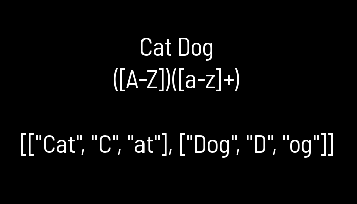

# Regex

> Regular Expression handler  
> Version 0.2.1  
> Chadnaut 2024  
> https://github.com/Chadnaut/Attract-Mode-Modules

## Quickstart

```cpp
::fe.load_module("regex");

local matches = Regex("([A-Z])([a-z]+)").match_all("Cat Dog");
// matches == [["Cat", "C", "at"], ["Dog", "D", "og"]]
```

\
*Example of match_all groups.*

## Functions

- `Regex(pattern)` - Create regular expression from the passed pattern
  - `test(value)` - Return true if pattern matches
  - `search(value, start = 0)` - Return index of pattern in value, or -1 if none
  - `match(value)` - Return array of full-matches
  - `match_all(value)` - Return array of group matches
  - `replace(value, replace)` - Replace first matching pattern
  - `replace_all(value, replace)` - Replace all matching patterns

Replace strings can use `$0` placeholders to insert match groups.