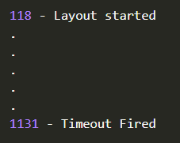

# Timer

> Call a function at a later time  
> Version 0.2  
> Chadnaut 2024  
> https://github.com/Chadnaut/Attract-Mode-Modules

## Quickstart

```cpp
fe.load_module("timer");

local start = fe.layout.time;
set_interval(@() print((fe.layout.time - start) + "\n"), 1000);
```

```log
1003
2003
3005
4005
5006
6007
7008
8009
9009
10010
```
*Calling a function repeatedly*

```cpp
fe.load_module("timer");

print(fe.layout.time + " - Layout started\n");
set_timeout(@() print(fe.layout.time + " - Timeout Fired\n"), 1000);
```

\
*Calling a function later*

## Functions

- `set_timeout(callback, delay?)` - Fire callback after delay, returns id
- `set_interval(callback, delay?)` - Fire callback **every** delay, returns id
- `clear_timeout(id)` - Remove timout by id
- `clear_interval(id)` - Remove interval by id

## Notes

- If `delay == 0` the callback will be fired on the next frame.
- If `delay < frametime` the callback will be fired multiple times.
- The exact callback time is dependant on frametime, and may be off by up to 16ms.